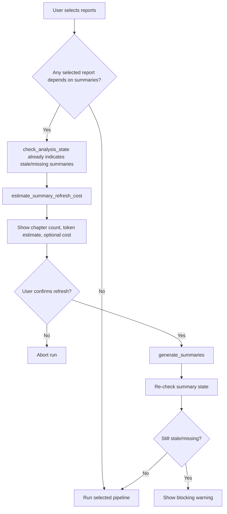
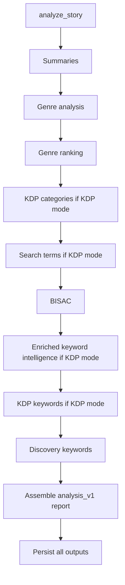

# Loremetry Desktop Technical Architecture

## 1. Scope and Audience

This document is an implementation-level technical reference for Loremetry Desktop.

It covers:

- Runtime architecture (Vue + Tauri + Rust)
- Command surface and frontend/backend boundaries
- Database schema and persistence model
- The chapter summary system in detail (staleness detection, hashing, refresh, storage)
- Analysis pipelines (KDP, Wide, Craft, Publish)
- Cost estimation math and model assignment
- Reporting and rendering pipeline
- Story and series lifecycle, including folder scaffolding
- External integrations and fallback behavior

## 2. High-Level Runtime Architecture

Loremetry Desktop is a local-first desktop app with a split architecture:

- Frontend: Vue 3 + TypeScript (Vite)
- Backend: Tauri command layer in Rust
- Storage: SQLite (structured data + report versions) and JSON file registry for stories
- AI/network: outbound HTTP calls from Rust (TokenMix and optional market-data providers)

Flow:

1. UI triggers a Tauri command via invoke.
2. Rust executes domain logic and persistence.
3. Rust emits progress events for long jobs.
4. UI listens to events and updates log stream/state.
5. Generated report documents are saved to SQLite and later rendered in UI.

## 3. Tech Stack and Build

Frontend dependencies (selected):

- vue
- @tauri-apps/api
- tiptap editor stack

Backend dependencies (selected):

- tauri 2.x and plugins (shell, dialog, fs, clipboard)
- rusqlite (bundled SQLite)
- reqwest + tokio for async HTTP
- serde/serde_json for typed payloads
- sha2 for chapter source hashing
- regex for parsing and text heuristics

## 4. Frontend Architecture

### 4.1 App Composition and Injection Model

The app root creates and provides composable contexts:

- stories context
- analysis context
- platform context
- settings context
- reports context
- series context

These contexts are distributed through typed injection keys so components can share a single reactive state model.

### 4.2 UI Mode and Panel Routing

There are two top-level modes:

- analyzer mode
- writing mode

Analyzer mode hosts panels such as Analyzer, Reports, Settings, Help, Story Form, Series Form, and Manuscript Viewer.

### 4.3 Core Composables

- useStories: story registry loading, active-story persistence, create/update/delete story entries
- useSettings: provider, API key, model assignments, folder structure settings, model loading
- useAnalysis: orchestration invocations and log/event handling
- useReports: sidebar report groups, opening/deleting report versions
- useSeries: list/create/update/delete series and book ordering
- useReportTypes: dynamic report catalog from DB (platforms, dependencies, model slots)

### 4.4 Event and Error Handling

- Progress events from backend:
  - genre:log
  - cdp:log
- Global Vue error handler writes a temporary error toast.

## 5. Backend Command Surface and Wiring

Tauri command registration is centralized in src-tauri/src/lib.rs.

Major command groups:

- AI and utility commands (list models, chat, cost estimation)
- Analysis commands (summaries, genre, categories, keywords, BISAC, craft/publish checks)
- Reports and storage commands
- Story and series management commands
- Folder-structure commands
- External provider commands (Canopy/DataForSEO)

The backend uses shared app state for SQLite connection and in-process cache state.

## 6. Persistence Model

### 6.1 SQLite as Primary Structured Store

Core tables include:

- genres, kdp_categories, genre_kdp_links
- chapter_summaries
- genre_data
- kdp_keywords, mi_search_terms, discovery_keywords
- keyword_search_results
- story_documents (versioned report documents)
- report_types (catalog + dependency + cost metadata)
- provider_models (seeded model pricing fallback catalog)
- app_settings
- bisac_codes, bisac_classifications
- series, series_books
- continuity_facts, continuity_findings
- zeigarnik_chapters, zeigarnik_threads
- prompt_templates
- preprocessed_chapters
- folder_structure
- lookup_config, zeigarnik_config

### 6.2 Story Registry File

Stories are persisted in a JSON file in app data (stories.json). This tracks story metadata and folder path.

SQLite handles analysis/report data; stories.json handles user story registration.

### 6.3 Seed and Migration Strategy

On startup DB init:

1. Create schema if missing.
2. Apply additive migrations with best-effort ALTER TABLE calls.
3. Seed baseline data (genres, BISAC, report types, prompts, provider model fallback catalog, lookup config).

Report and prompt seed logic is designed so new app builds can ship updated defaults.

## 7. Provider and Model Strategy

Current provider policy is TokenMix-only at runtime.

- Any non-tokenmix provider request returns an explicit unsupported-provider error.
- Model listing and calls use TokenMix endpoints.
- Claude-family model IDs are still supported through TokenMix model naming and alias normalization.

Why compatibility still works:

- The app builds model candidate aliases (for common provider-style variants).
- Pricing fallback can map known seeded model IDs to alias forms used by TokenMix.

## 8. Chapter Summary System (Detailed)

This is the canonical preflight stage for many reports.

### 8.1 Inputs

- Story folder
- Provider (TokenMix)
- API key
- Model (typically summaries slot)

### 8.2 File Discovery

- Chapters are collected from manuscript structure (Markdown files).
- Empty or unreadable chapters are skipped with log output.

### 8.3 Normalization and Hashing

For each chapter:

1. Read source text.
2. Run clean_for_ai:
   - strips non-visible control characters
   - drops unsafe control chars
   - compacts whitespace
3. Compute SHA-256 source_hash on cleaned text.

This hash is compared to stored chapter_summaries.source_hash.

- Match: summary is considered up-to-date and skipped.
- Mismatch or missing: chapter is queued for re-summarization.

### 8.4 Summarization Call Shape

Each changed chapter invokes prompt-driven LLM summarization with truncated chapter input (up to report-configured limits; chapter summaries use 8000-word truncation in report type metadata).

### 8.5 Storage

On success, each chapter summary persists:

- story_folder
- file
- title
- signals (compact summary signal text)
- source_hash
- word_count
- updated_at

Then a report document version is saved with schema chapter_summaries_v1 for UI viewing.

### 8.6 Staleness Detection for UI Preflight

check_analysis_state computes:

- summary_missing_count
- summary_stale_count
- missing/stale file lists

It re-hashes current chapter content and compares to stored hashes, so the frontend can warn before running dependent reports.

### 8.7 Forced Re-summarize

Analyze requests can set force_resummarize, which deletes stored summaries first and regenerates all chapter summaries.

## 9. Summary Refresh Cost Estimation

The app supports a one-time estimate for only changed/new chapters before refresh.

### 9.1 Algorithm

1. Compute changed chapter set from hash mismatch/missing hash.
2. Derive per-chapter word counts after clean_for_ai.
3. Load cost params for chapter_summaries from report_types.
4. Estimate token usage:

$$
input\_tokens = \sum\limits_{chapters} (\min(words, truncation) \cdot 1.3 + 400)
$$

$$
output\_tokens = changed\_chapter\_count \cdot output\_max
$$

5. If input/output model prices are available:

$$
cost = \frac{input\_tokens}{1000} \cdot input\_price + \frac{output\_tokens}{1000} \cdot output\_price
$$

6. Return file list, token estimates, and optional cost.

Constants used:

- words-to-tokens factor: 1.3
- system prompt overhead estimate: 400 tokens

## 10. Full Report Cost Estimation

For selected visible reports, frontend sends report_id plus model prices.

Backend loads report_types cost metadata:

- cost_truncation
- cost_output_max
- cost_per_chapter
- cost_fixed_calls

It computes call count and input/output token estimates per report, then estimated USD cost. Non-AI reports resolve to zero cost.

## 11. Analysis Pipelines

### 11.1 analyze_story (Main KDP/Wide Pipeline)

Typical order:

1. Chapter summaries
2. Genre analysis
3. Genre ranking
4. KDP categories (skipped in wide mode)
5. Search terms (KDP-only)
6. BISAC
7. Enriched keyword intelligence via DataForSEO (with Canopy fallback only when DataForSEO credentials are absent) (KDP-only)
8. KDP keyword optimization (KDP-only)
9. Discovery keywords
10. Assemble combined analysis report

Outputs are persisted incrementally into story_documents and domain tables.

### 11.2 run_craft_pipeline

Selected craft/publish reports are executed with dependency-aware ordering and per-function model slots:

- summaries
- zeigarnik (no AI)
- continuity (manuscript or series scope)
- show-dont-tell
- ai-isms
- manuscript and series craft audits
- publish audits (AI beta reader, cliffhanger score, hook strength, pacing curve, line polish, vellum prep)

### 11.3 Cancellation

Long-running commands are wrapped with cancellation notifications and explicit is_cancelled checks between stages.

## 12. Prompt Execution System

Prompt templates are database-backed (prompt_templates).

Execution path:

1. Load template by id.
2. Fill placeholders in system and user templates.
3. Route to call_llm or call_llm_json depending on json_mode.
4. Parse/extract JSON where required by report logic.

Bible context:

- Auto-discovery from configured Bible/Characters/Locations folders.
- Fallback to explicit bible path.
- Truncates to bounded word count.

Preprocessed chapter cache:

- preprocessed_chapters stores per-report-type normalized input text.
- Invalidated by source file modified timestamp changes.

## 13. Report Storage and Rendering

### 13.1 Versioned Report Storage

Every generated report insert creates a new row in story_documents.

- No overwrite-in-place semantics for report versions.
- Sidebar grouping is based on report type + versions.

### 13.2 Report Envelope

get_report_cmd returns:

- id
- doc_type
- label
- format (json/markdown auto-detected)
- content
- generated_at

### 13.3 Frontend Rendering

reportRenderer.ts dispatches by schema identifier, rendering strongly-typed HTML sections for known schemas, and formatted JSON fallback for unknown schemas.

## 14. Stories and Series

### 14.1 Stories

- Stories can reference existing folders (add_story).
- init_story can scaffold a new folder tree from folder_structure config.
- Active story id is persisted in app_state.

### 14.2 Series

- Series metadata in SQLite (series, series_books).
- Series can be created with zero books.
- Optional create_empty mode can scaffold a series folder with Bible/Characters/Locations/Books and configured extra folders.
- Series continuity checks run over books in reading order.

## 15. Folder Structure System

Folder layout is configurable and stored in SQLite.

Roles:

- manuscript
- bible
- characters
- locations
- acts under manuscript
- optional extra scaffold-only folders

Normalization safeguards:

- reject path traversal patterns
- normalize separators
- prevent act folders from being duplicated into extras

## 16. External Integrations

### 16.1 TokenMix (LLM)

- Model list endpoint and chat-completions endpoint
- Retry/candidate model normalization behavior in model selection path

### 16.2 Canopy

- Category/competition operations
- Optional fallback for keyword search when DataForSEO creds are absent

### 16.3 DataForSEO

- Amazon keyword search volume/competition sourcing
- Optional Google search-volume enrichment for discovery keywords
- Enriched KDP keyword intelligence pipeline:
  - Google autocomplete expansion for long-tail seed growth
  - Amazon related-keyword expansion
  - ASIN-driven enrichment from competition_data using ranked keywords and product competitors
  - Cross-ASIN keyword intersections for higher-intent overlap terms
  - Bulk Amazon search-volume normalization across the merged candidate set
  - Trend-delta enrichment from DataForSEO Trends

## 16.4 DataForSEO Enriched Keyword Intelligence (Implemented)

The KDP keyword-search stage now uses a multi-source enrichment workflow in backend code at src-tauri/src/analysis/keywords.rs and src-tauri/src/dataforseo.rs.

Primary goal:

- Improve keyword quality beyond seed-only expansion by combining semantic, product-rank, and trend signals before KDP keyword optimization.

Execution sequence:

1. Start from derived seed terms.
2. Expand candidate set with Google autocomplete suggestions from DataForSEO SERP API.
3. Add Amazon related-keyword candidates with initial volume signals.
4. Read competitor ASINs from the latest competition_data document.
5. Expand ASIN set with Amazon product competitors.
6. Pull ranked keywords for selected ASINs.
7. Pull product keyword intersections for top ASIN combinations.
8. Normalize merged candidates with Amazon bulk search volume.
9. Enrich top candidates with trend deltas from DataForSEO Trends.
10. Emit deduped, ranked keyword_search_results for downstream optimization.

Internal scoring and output shaping:

- Keyword deduplication is case-insensitive.
- Final competition labels are currently volume-banded:
  - High: > 50,000
  - Medium: > 5,000
  - Low: <= 5,000
- The result set is sorted by search volume descending and capped for safety.
- Provenance and trend notes are carried into estimated_earnings as metadata text so downstream UI remains backward-compatible without schema changes.

Persistence and compatibility:

- Persisted storage path is unchanged (keyword_search_results in SQLite).
- No frontend contract changes were required.
- Existing KDP keyword optimization consumes the richer pool automatically.

## 17. Chat with Context (Writing Mode)

chat_with_context builds a prompt from:

- system template (writing_chat)
- bible section (if present)
- current chapter title/text (chapter text bounded)
- prior message history
- current user message

Request is sent through TokenMix OpenAI-compatible chat-completions API.

## 18. Logging, Observability, and Activity Trail

- Backend emits progress logs during long operations.
- Frontend classifies logs by prefix (success/warn/error/step/detail).
- Activity logs are stored as report documents using schema activity_log_v1.

## 19. Key Data and Control Flows

### 19.1 Summary Refresh Preflight

### 19.2 Analyze Story Pipeline

## 20. Operational Notes

- The app is local-first and can continue to display persisted report versions offline.
- AI-dependent commands require configured API credentials and model selections.
- Non-AI analyses (for example Zeigarnik heuristics) do not require LLM calls.
- Report behavior and model-routing assumptions are data-driven through report_types and prompt_templates where possible.

## 21. Quick File Map (Primary Ownership)

- src/App.vue: app shell, panel routing, context wiring
- src/composables/useAnalysis.ts: command orchestration from UI
- src/composables/useSettings.ts: provider/model/settings state and persistence
- src/components/AnalyzerPanel.vue: report selection, preflight summary refresh, cost UX
- src/reportRenderer.ts: schema-driven report rendering
- src-tauri/src/lib.rs: Tauri command registration
- src-tauri/src/commands.rs: LLM client, model listing, cost estimation, chat
- src-tauri/src/analysis/chapters.rs: chapter summary generation + hashing logic
- src-tauri/src/analysis/pipeline.rs: main pipeline orchestration and craft pipeline
- src-tauri/src/prompts.rs: prompt template execution and bible/preprocess helpers
- src-tauri/src/db.rs: schema, migrations, seed data, report/query commands
- src-tauri/src/stories.rs: story registry and story scaffolding
- src-tauri/src/series.rs: series CRUD and optional empty-series scaffold
- src-tauri/src/folder_structure.rs: configurable folder layout and normalization

## 22. Command-by-Command API Contracts

This section is the canonical IPC contract for the Tauri invoke surface (the commands registered in lib.rs).

Columns:

- Command: invoke name
- Input: payload shape (or named request type)
- Output: success/return type
- Frontend Caller(s): where invoke is called from in src
- Side Effects: what state is read/written
- Errors: main error behavior

### 22.1 Core Commands (commands.rs)

| Command | Input | Output | Frontend Caller(s) | Side Effects | Errors |
|---|---|---|---|---|---|
| analyze_csv | CsvRequest | AnalyzerResult | No direct invoke in src (backend-capable command) | Calls AI with csv_competition_analysis prompt; emits cdp:log | Returns success false with error string |
| list_models | provider, apiKey | Result<ModelsResult, String> | src/composables/useSettings.ts | Fetches TokenMix model catalog; enriches with DB fallback pricing aliases | Unknown provider or HTTP/parse failures |
| read_chapter | file_path | Result<String, String> | src/components/ChapterEditor.vue, src/components/WritingPanel.vue | Reads exact file or recursive fallback by filename | Not found/read failures |
| save_chapter | file_path, content | Result<(), String> | src/components/ChapterEditor.vue | Overwrites chapter file; fallback filename resolution | Write failures |
| write_manuscript_fix | file_path, old_text, new_text | No direct invoke in src (currently backend-capable only) | No direct invoke in src | Text replacement write; returns applied content | Replace/write failure |
| list_manuscript_files | folder | Result<Vec<FileTreeEntry>, String> | src/components/Sidebar.vue | Walks story folder, builds file tree metadata | Invalid folder/read failure |
| estimate_report_costs | CostEstimateRequest | Result<CostEstimateResult, String> | src/components/AnalyzerPanel.vue | Reads report_types cost params and chapter sizes; computes per-report token/cost estimates | Missing folder or DB lock errors |
| estimate_summary_refresh_cost | SummaryRefreshEstimateRequest | Result<SummaryRefreshEstimateResult, String> | src/components/AnalyzerPanel.vue | Hash-diff check for stale/new chapters; estimates refresh tokens/cost | Missing folder or DB lock errors |
| chat_with_context | ChatRequest | Result<ChatResponse, ()> | src/components/AiChat.vue | Loads writing_chat prompt, composes context messages, calls TokenMix chat endpoint | Unsupported provider, auth/model missing, HTTP/parse/API errors |

### 22.2 Analysis Commands (analysis/*)

| Command | Input | Output | Frontend Caller(s) | Side Effects | Errors |
|---|---|---|---|---|---|
| generate_summaries | FolderRequest | GenreResult | src/composables/useAnalysis.ts | Summarizes changed/new chapters; writes chapter_summaries and emits genre:log | Folder/file/AI failures per chapter; aggregate result includes counts |
| analyze_genre | FolderRequest | GenreResult | No direct invoke in src (invoked via pipeline commands) | Ensures summaries, runs genre analysis, writes genre_data + genre_analysis document | Missing folder/summaries or AI parse/call errors |
| rank_genres_for_story | FolderRequest | GenreResult | No direct invoke in src (invoked via pipeline commands) | Ranks against taxonomy, writes genre_rankings + genre_ranking document | Missing genre_data/taxonomy/AI errors |
| find_categories_for_story | FindCategoriesRequest | GenreResult | No direct invoke in src | Category-finder pipeline persistence and reporting | Input/catalog/AI failures |
| match_categories_for_story | FindCategoriesRequest | GenreResult | No direct invoke in src | Matches requested categories and stores category_results output | Lookup/match failures |
| verify_mapped_categories | VerifyMappedRequest | Result<GenreResult, ()> | No direct invoke in src | Verifies mapped categories with live stats and updates report data | Canopy/API/lookup failures |
| classify_bisac_for_story | FolderRequest | GenreResult | No direct invoke in src (invoked via pipeline commands) | BISAC picks + db writes to bisac_classifications and report document | Missing genre_data/BISAC seed or AI parse/call errors |
| generate_search_terms | KeywordRequest | GenreResult | No direct invoke in src (invoked via pipeline commands) | Writes mi_search_terms + document | Missing genre_data or AI parse/call errors |
| optimize_keywords | KeywordRequest | GenreResult | No direct invoke in src (invoked via pipeline commands) | Writes kdp_keywords + document | Missing genre_data or AI parse/call errors |
| pick_manuscript_folder | title? | Result<String, String> | src/components/StoryForm.vue, src/components/SeriesForm.vue | Opens native folder picker dialog | User cancel/no folder selected |
| check_analysis_state | folder | AnalysisState | src/composables/useAnalysis.ts | Reads summary freshness/doc availability flags | Returns empty-like state on lookup issues |
| run_everything | FolderRequest | GenreResult | No direct invoke in src | Runs summarized KDP flow and writes generated docs | Cancels or stage failures short-circuit |
| run_full_analysis | FolderRequest | GenreResult | No direct invoke in src | Ensures summaries+genre then writes full_report | Missing folder/summaries or AI failures |
| find_genres_and_categories_for_story | FolderRequest | GenreResult | No direct invoke in src | One-pass genre+category+BISAC report assembly and storage | Stage-level failures/cancellation |
| analyze_story | AnalyzeStoryRequest | GenreResult | src/composables/useAnalysis.ts | Main KDP/Wide pipeline; persists all intermediate/final documents | Missing credentials/folder or stage failures |
| run_craft_pipeline | CraftPipelineRequest | GenreResult | src/composables/useAnalysis.ts | Runs selected craft/publish audits in order; writes corresponding docs | Missing AI config for selected AI reports; stage failures |
| analyze_zeigarnik_for_story | ZeigarnikRequest | GenreResult | No direct invoke in src (called from run_craft_pipeline) | Non-AI text heuristics; writes zeigarnik tables + document | Missing folder/chapters or persistence failures |
| check_continuity_for_story | ContinuityRequest | GenreResult | No direct invoke in src (called from run_craft_pipeline) | Extract/judge pass; writes continuity_facts/findings + continuity_check document | AI extraction/judgment failures |
| check_continuity_for_series | SeriesContinuityRequest | GenreResult | No direct invoke in src (called from run_craft_pipeline) | Series-wide continuity across ordered books; writes findings + document | Series missing/empty or AI failures |
| suggest_continuity_fix | SuggestFixRequest | SuggestFixResult | src/components/ManuscriptViewer.vue | AI rewrite suggestion for continuity finding | AI/prompt/parse failures |
| check_show_dont_tell | ShowDontTellRequest | GenreResult | No direct invoke in src (called from run_craft_pipeline) | Per-chapter AI violation extraction; writes show_dont_tell document | Missing API settings, file reads, AI failures |
| suggest_sdt_fix | SuggestSdtFixRequest | SuggestSdtFixResult | src/components/ManuscriptViewer.vue | AI rewrite suggestion for show-dont-tell finding | AI/prompt/parse failures |
| check_ai_isms | AiIsmsRequest | GenreResult | No direct invoke in src (called from run_craft_pipeline) | Per-chapter AI-isms extraction; writes ai_isms document | Missing API settings, file reads, AI failures |
| suggest_ai_isms_fix | SuggestAiIsmsFixRequest | SuggestAiIsmsFixResult | src/components/ManuscriptViewer.vue | AI rewrite suggestion for AI-isms finding | AI/prompt/parse failures |

### 22.3 Taxonomy, Reports, and App DB Commands (db.rs + genre_taxonomy.rs)

| Command | Input | Output | Frontend Caller(s) | Side Effects | Errors |
|---|---|---|---|---|---|
| get_genre_taxonomy | none | Result<Vec<GenreRow>, String> | No direct invoke in src | Reads genre taxonomy snapshot | DB read errors |
| list_genres_cmd | none | Result<Vec<GenreRow>, String> | No direct invoke in src | Reads genres table | DB read errors |
| add_kdp_path_cmd | AddKdpPathRequest | Result<(), String> | No direct invoke in src | Inserts/links KDP category path to genre map | Validation/DB errors |
| list_report_types_cmd | none | Result<Vec<ReportTypeDef>, String> | src/composables/useReportTypes.ts | Reads report catalog metadata (platforms, depends_on, model_slot, min_tier) | DB read errors |
| list_reports_cmd | folder | Result<Vec<DocMeta>, String> | No direct invoke in src (sidebar uses get_sidebar_reports) | Lists versioned story_documents metadata | DB read errors |
| save_activity_log_cmd | folder, content, timestamp | Result<(), String> | src/composables/useAnalysis.ts | Persists activity_log document version | DB write errors |
| get_report_cmd | id | Result<ReportEnvelope, String> | src/composables/useReports.ts | Reads report payload; auto-detects json vs markdown format | Not found/DB errors |
| delete_report_cmd | id | Result<(), String> | src/composables/useReports.ts | Deletes one report version row | Not found/DB errors |
| get_sidebar_reports | folder, platform | Result<Vec<SidebarReportGroup>, String> | src/composables/useReports.ts | Groups report versions by type filtered by platform | DB read errors |
| list_series_cmd | none | Result<Vec<SeriesRow>, String> | No direct invoke in src | Reads lightweight series list | DB read errors |
| create_series_cmd | name | Result<SeriesRow, String> | No direct invoke in src | Inserts DB-level series row | DB write errors |
| delete_series_cmd | series_id | Result<(), String> | No direct invoke in src | Deletes DB-level series and links | DB delete errors |
| list_series_books_cmd | series_id | Result<Vec<SeriesBookRow>, String> | No direct invoke in src | Reads DB series book order entries | DB read errors |
| add_story_to_series_cmd | AddToSeriesRequest | Result<(), String> | No direct invoke in src | Adds story membership/order to series_books | DB write/constraint errors |
| remove_story_from_series_cmd | series_id, story_folder | Result<(), String> | No direct invoke in src | Removes membership from series_books | DB delete errors |

### 22.4 Settings and App State Commands (settings.rs)

| Command | Input | Output | Frontend Caller(s) | Side Effects | Errors |
|---|---|---|---|---|---|
| load_ui_settings | none | Result<UiSettings, String> | src/composables/useSettings.ts | Reads app_settings values and normalizes provider to tokenmix | DB lock/read errors |
| save_ui_settings | UiSettings | Result<UiSettings, String> | src/composables/useSettings.ts | Upserts app_settings values; coerces provider to tokenmix | DB transaction errors |
| load_app_state | none | Result<AppState, String> | src/composables/useStories.ts, src/composables/usePlatform.ts | Reads persisted platform and active_story_id | DB lock/read errors |
| save_app_state | AppState | Result<AppState, String> | src/composables/useStories.ts, src/composables/usePlatform.ts | Upserts platform and active_story_id | DB transaction errors |

### 22.5 Story, Series, and Folder Structure Commands

| Command | Input | Output | Frontend Caller(s) | Side Effects | Errors |
|---|---|---|---|---|---|
| list_stories | none | StoriesResult | src/composables/useStories.ts | Reads stories.json registry | File parse/read errors in error field |
| add_story | AddStoryRequest | StoriesResult | src/composables/useStories.ts | Registers existing folder in stories.json | Missing folder / write errors |
| init_story | InitStoryRequest | StoriesResult | src/composables/useStories.ts | Scaffolds folder_structure dirs and registers story | Parent/folder exists/scaffold/write errors |
| update_story | UpdateStoryRequest | StoriesResult | src/composables/useStories.ts | Updates story metadata in stories.json | Missing folder / write errors |
| delete_story | id | StoriesResult | src/composables/useStories.ts | Removes story registry entry (does not delete folder) | Read/write errors |
| create_story_document | CreateDocumentRequest | Result<CreateDocumentResult, String> | src/components/NewDocumentForm.vue | Creates markdown file under story folder | Path validation/create/write errors |
| delete_story_document | path | Result<(), String> | src/components/ManuscriptViewer.vue, src/components/WritingPanel.vue | Deletes a document file | Not found/delete errors |
| list_series | none | SeriesResult | src/composables/useSeries.ts | Reads series and series_books from SQLite | DB errors mapped in response |
| create_series | CreateSeriesRequest | SeriesResult | src/composables/useSeries.ts | Creates series row; optionally scaffolds empty series folder tree | Validation/scaffold/DB errors |
| update_series | UpdateSeriesRequest | SeriesResult | src/composables/useSeries.ts | Updates series metadata and book order | Validation/DB errors |
| delete_series | id | SeriesResult | src/composables/useSeries.ts | Deletes series and related books | DB errors |
| get_folder_structure | none | FolderStructure | src/composables/useSettings.ts | Loads/caches folder structure from DB/legacy source | Defaults used if missing |
| save_folder_structure | FolderStructure | Result<FolderStructure, String> | src/composables/useSettings.ts | Normalizes and persists folder structure | Validation/DB errors |

### 22.6 Catalog Import and Cancellation

| Command | Input | Output | Frontend Caller(s) | Side Effects | Errors |
|---|---|---|---|---|---|
| import_winningcat_csv | none (file picker) | ImportResult | src/components/settings/tabs/SettingsWinningCatTab.vue | Imports/updates kdp_categories from CSV; updates stale markers | Dialog parse/import errors in result |
| remove_stale_kdp_categories | since | StaleCleanupResult | src/components/settings/tabs/SettingsWinningCatTab.vue | Deletes stale category rows older than last import marker | DB delete errors in result |
| cancel_operation | none | void | src/composables/useAnalysis.ts | Sets global cancel flag and notifies waiters | N/A |

### 22.7 Canopy Integration Commands (canopy.rs)

| Command | Input | Output | Frontend Caller(s) | Side Effects | Errors |
|---|---|---|---|---|---|
| test_canopy_connection | api_key | CanopyTestResult | src/composables/useSettings.ts | Validates API connectivity | Returns success false + error |
| analyze_categories_canopy | paths, store, canopy_api_key | AnalyzerResult | No direct invoke in src | Fetches live category stats/top books; emits cdp:log | API/node-id/lookup failures reflected per row |
| analyze_competition_canopy | CompetitionCanopyRequest | CompetitionResult | No direct invoke in src | Runs keyword-based competition harvest + AI synthesis; writes competition_data/report docs | Missing search terms/API/AI failures |
| search_keywords_canopy | KeywordSearchCanopyRequest | KeywordSearchResponse | No direct invoke in src (invoked by backend pipeline) | Autocomplete + search heuristics for keyword list | API failures return partial/empty results |
| mine_competitor_reviews | ReviewMiningRequest | ReviewMiningResult | No direct invoke in src (invoked by backend pipeline) | Pulls review samples and runs AI summarization; writes document | API/AI failures |
| analyze_comp_authors | AuthorAnalysisRequest | AuthorAnalysisResult | No direct invoke in src (invoked by backend pipeline) | Aggregates competitor author signals; writes document | API/AI failures |
| deep_category_analysis | canopy_api_key, category_path, node_id, store | DeepCategoryResult | No direct invoke in src | Deep live category intelligence fetch and structured response | API lookup failures |
| run_market_intel | MarketIntelRequest | GenreResult | src/composables/useAnalysis.ts | Market-intel orchestration via Canopy + AI, persists outputs | Stage-level/API/AI failures |

### 22.8 DataForSEO Integration Commands (dataforseo.rs)

| Command | Input | Output | Frontend Caller(s) | Side Effects | Errors |
|---|---|---|---|---|---|
| test_dataforseo_connection | login, password | DfsTestResult | src/composables/useSettings.ts | Validates DataForSEO credentials | Returns success false + error |
| search_amazon_keywords | app, seeds, login, password | KeywordSearchResponse | No direct invoke in src (backend-capable helper command) | Fetches related Amazon keywords and volumes; emits cdp:log | Auth/API errors produce failure response |
| search_google_keywords | app, keywords, login, password | KeywordSearchResponse | No direct invoke in src (invoked by backend pipeline) | Fetches Google volume/CPC metrics; emits cdp:log | Auth/API errors produce failure response |

Note:

- The main analyze_story pipeline currently uses internal DataForSeoClient methods directly (run_keyword_searches_dataforseo in analysis/keywords.rs) to execute the enriched multi-endpoint flow described in section 16.4.

